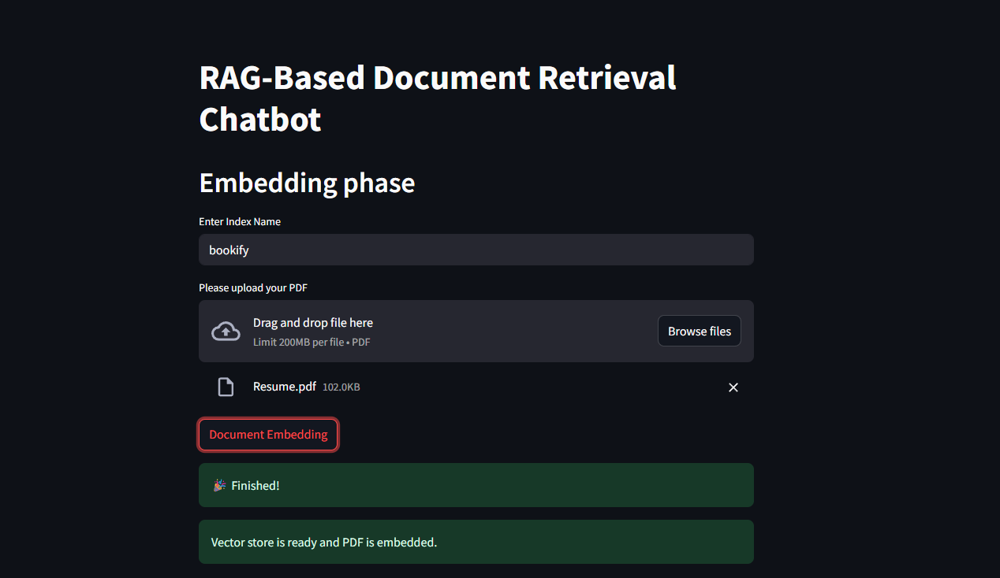
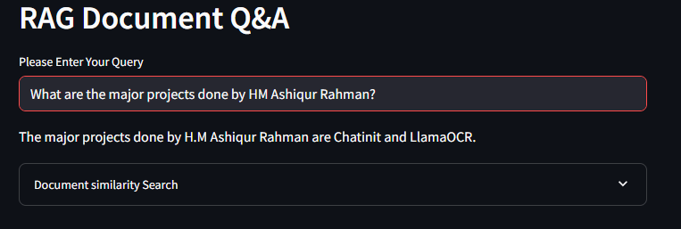

# Bookify 📚 — RAG Based PDF Question Answering App

Bookify is a Retrieval-Augmented Generation (RAG) based application that allows users to upload PDF documents, store them in a vector database (Pinecone), and ask questions about the content using a Large Language Model (LLM) through Langchain.

## 🚀 Features

- Upload PDF files
- Store embeddings in Pinecone vector store
- Query content using natural language
- Get context-aware answers powered by Langchain and LLMs
- Built with Streamlit for an interactive web experience

## 🛠 Tools and Technologies

- [Langchain](https://www.langchain.com/)
- [Streamlit](https://streamlit.io/)
- [Pinecone](https://www.pinecone.io/)
- [Python](https://www.python.org/)

## 📸 Demo Screenshots





---

## 🧪 Installation

### 1. Clone the repository

```bash
git clone https://github.com/ashiqdotexe/bookify.git
cd bookify
```

### 2. Create a virtual environment and activate it

#### Windows
```bash
python -m venv venv
venv\Scripts\activate
```

#### macOS/Linux
```bash
python3 -m venv venv
source venv/bin/activate
```

### 3. Install dependencies

```bash
pip install -r requirements.txt
```

### 4. Configure environment variables

Rename `.env_example` to `.env` and edit the values accordingly (e.g. API keys, Pinecone config).

### 5. Run the app

```bash
streamlit run bookify.py --server.fileWatcherType none
```

---

## 📬 Feedback

For any feedback or suggestions, feel free to reach out:

- 📧 Email: [ashiqurrahman.sohan.muslim@gmail.com](mailto:ashiqurrahman.sohan.muslim@gmail.com)
- 💼 LinkedIn: [HM Ashiqur Rahman](https://www.linkedin.com/in/hmashiqurrahman/)

---

## ⭐️ Show your support

If you like this project, give it a ⭐️ on [GitHub](https://github.com/ashiqdotexe/bookify)!